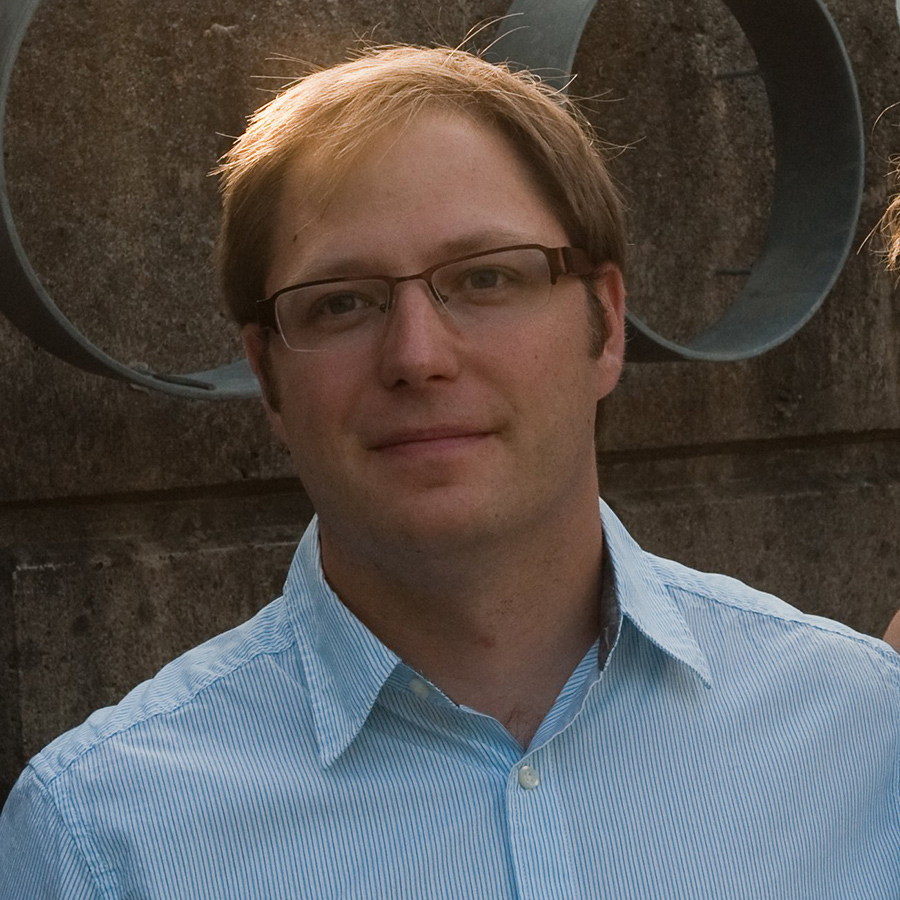

PhD Astrophysics, Saint Mary’s University

Chris has been working in HPC since 2005 and joined ACENET in 2015, with a focus on Big Data. During his PhD he developed a multi-dimensional hydrodynamics code utilizing the parallel environment at ACENET to explore the interaction of convection and radial pulsation in RR Lyrae variable stars. A key component of this work was developing a domain decomposition framework using OpenMPI to parallelize the code.

More recently he was an associate research fellow at the University of Exeter where he worked on a team of international researchers. Key roles included the continued development of a hydrodynamics code, analysis and visualization of the resulting large datasets, development and maintenance of command-line tools used by the group, and to conduct novel research. His focus was on understanding how newly accreted material is redistributed by convection in young forming stars, and how the existing convection is modified by the accretion of new material.

In addition to these formal roles Chris also has interests in visualization and 3D computer graphics.